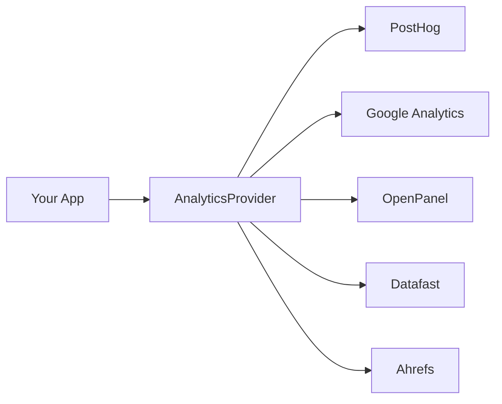

`@repo/analytics` provides a unified interface for tracking events across multiple analytics providers. Write once, send everywhere.

## Features

- **Multi-provider support** - PostHog, Google Analytics, GTM, OpenPanel, Datafast, Ahrefs
- **Automatic page tracking** - Tracks route changes in Next.js
- **Feature flags** - Built-in support for PostHog feature flags
- **Type-safe** - Full TypeScript support for events and properties
- **Plugin architecture** - Easy to add or remove providers

## Quick Setup

### 1. Configure Plugins

```tsx title="lib/analytics.ts"
import {
  PostHogPlugin,
  GoogleAnalyticsPlugin
} from "@repo/analytics"

export const analyticsPlugins = [
  PostHogPlugin({
    apiKey: process.env.NEXT_PUBLIC_POSTHOG_KEY!
  }),
  GoogleAnalyticsPlugin({
    measurementId: process.env.NEXT_PUBLIC_GOOGLE_ANALYTICS_ID!
  })
]
```

### 2. Add Provider

```tsx title="app/providers.tsx"
"use client"

import { AnalyticsProvider } from "@repo/analytics"
import { analyticsPlugins } from "@/lib/analytics"

export function Providers({ children, flags }) {
  return (
    <AnalyticsProvider flags={flags} plugins={analyticsPlugins}>
      {children}
    </AnalyticsProvider>
  )
}
```

### 3. Track Events

```tsx
"use client"

import { useAnalytics } from "@repo/analytics"

export function SignUpButton() {
  const { track, identify, page, reset } = useAnalytics()

  return (
    <button onClick={() => track("SIGNUP_CLICKED", { source: "hero" })}>
      Get Started
    </button>
  )
}
```

## How It Works

The `AnalyticsProvider` wraps your app and manages connections to all configured providers. When you call `track()`, the event is sent to every provider simultaneously.



Events are fanned out automatically—no need to call each provider individually.

## Usage

### useAnalytics

The main hook for tracking events and identifying users:

```tsx
"use client"

import { useAnalytics } from "@repo/analytics"

export function MyComponent() {
  const { track, identify, page, reset } = useAnalytics()

  // ...
}
```

| Method | Description |
|--------|-------------|
| `track(event, properties?)` | Track a custom event with optional properties |
| `identify(userId, traits?)` | Associate events with a user identity |
| `page(name?, properties?)` | Track a page view (automatic in Next.js) |
| `reset()` | Clear user identity (on logout) |

#### track

```tsx
track("BUTTON_CLICKED", { 
  buttonId: "signup-hero",
  variant: "primary" 
})
```

#### identify

```tsx
identify(user.id, {
  email: user.email,
  plan: user.plan,
  createdAt: user.createdAt
})
```

#### reset

```tsx
async function handleLogout() {
  await signOut()
  reset()
}
```

### useFlag

Access feature flags from PostHog:

```tsx
"use client"

import { useFlag } from "@repo/analytics"

export function NewFeature() {
  const isEnabled = useFlag("new-checkout-flow")

  if (!isEnabled) return null

  return <NewCheckoutFlow />
}
```

See [Feature Flags](/docs/analytics/feature-flags) for setup details.

## Provider Options

| Provider | Best For |
|----------|----------|
| PostHog | Product analytics, feature flags, session recordings |
| Google Analytics | Traffic analysis, marketing attribution |
| Google Tag Manager | Tag management, loading multiple tracking scripts |
| OpenPanel | Privacy-focused, self-hostable |
| Datafast | Privacy-focused analytics, revenue attribution |
| Ahrefs | SEO and traffic analytics |

You can use one provider or all of them together.

## Next Steps

- [Track events](/docs/analytics/tracking-events) - Learn the tracking API
- [Identify users](/docs/analytics/identifying-users) - Associate events with users
- [Feature flags](/docs/analytics/feature-flags) - Control feature rollouts
