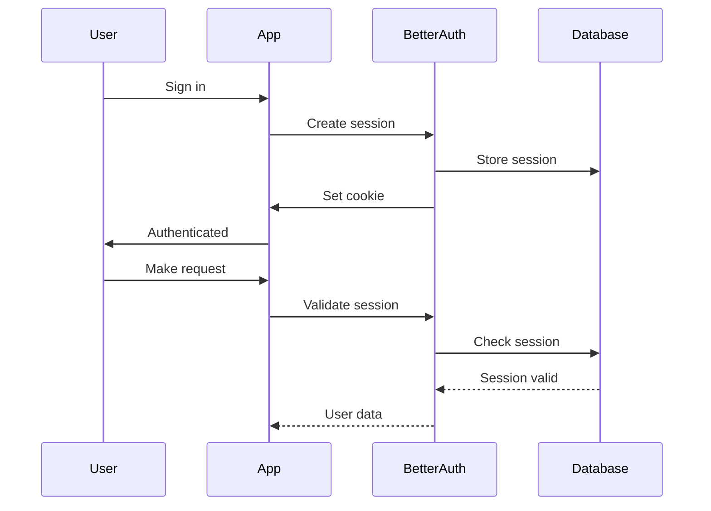

Sessions track authenticated users across requests. Better Auth handles session storage, cookies, and expiration automatically.

## Default Configuration

Out of the box, sessions are configured with:

| Setting | Default | Description |
|---------|---------|-------------|
| `expiresIn` | 7 days | Session duration |
| `updateAge` | 24 hours | How often to refresh |

Sessions refresh automatically when users are active.

## How Sessions Work



## Customizing Session Duration

```tsx title="lib/auth.ts"
import { betterAuth } from "better-auth"

export const auth = betterAuth({
  // ...
  session: {
    expiresIn: 60 * 60 * 24 * 30,  // 30 days
    updateAge: 60 * 60 * 24        // Refresh every 24 hours
  }
})
```

### Common Configurations

| Use Case | expiresIn | updateAge |
|----------|-----------|-----------|
| Standard app | 7 days | 24 hours |
| High security | 1 hour | 15 minutes |
| "Remember me" | 30 days | 24 hours |
| Mobile app | 90 days | 7 days |

## Session Storage

Sessions are stored in your database via the Drizzle adapter:

```tsx
database: drizzleAdapter(db, {
  provider: "pg",
  schema: {
    session: sessionsTable  // Your sessions table
  }
})
```

The sessions table stores:
- `id` - Unique session ID
- `userId` - Associated user
- `token` - Session token (in cookie)
- `expiresAt` - Expiration timestamp
- `ipAddress` - Client IP (optional)
- `userAgent` - Browser info (optional)

## Accessing Session Data

### In Server Components

```tsx
import { auth } from "@/lib/auth"
import { headers } from "next/headers"

export default async function Page() {
  const session = await auth.api.getSession({
    headers: await headers()
  })

  // session.user - User object
  // session.session - Session metadata
}
```

### In Client Components

```tsx twoslash
"use client"

import { useAuth } from "@startupkit/auth"

export function Component() {
  const { user, isAuthenticated, isLoading } = useAuth()
}
```

### Session Metadata

```tsx
const session = await auth.api.getSession({
  headers: await headers()
})

console.log(session.session)
// {
//   id: "session_123",
//   userId: "user_456",
//   expiresAt: Date,
//   ipAddress: "192.168.1.1",
//   userAgent: "Mozilla/5.0..."
// }
```

## Invalidating Sessions

### Sign Out Current Session

```tsx
"use client"

import { useAuth } from "@startupkit/auth"

export function LogoutButton() {
  const { logout } = useAuth()

  return <button onClick={logout}>Sign Out</button>
}
```

### Sign Out All Sessions

For "sign out everywhere" functionality:

```tsx
import { auth } from "@/lib/auth"
import { headers } from "next/headers"

export async function signOutAll() {
  const session = await auth.api.getSession({
    headers: await headers()
  })

  if (session) {
    // Delete all sessions for this user
    await db.delete(sessions)
      .where(eq(sessions.userId, session.user.id))
  }
}
```

## Session Refresh

Sessions automatically refresh when `updateAge` has passed:

1. User makes a request
2. Better Auth checks session age
3. If older than `updateAge`, extends `expiresAt`
4. User continues without interruption

This ensures active users stay logged in.

## Cookie Configuration

Better Auth uses secure HTTP-only cookies:

```tsx
export const auth = betterAuth({
  // Cookies are configured automatically, but you can customize:
  advanced: {
    cookiePrefix: "myapp",  // Custom cookie prefix
    crossSubDomainCookies: {
      enabled: true,
      domain: ".myapp.com"  // Share across subdomains
    }
  }
})
```

### Cookie Settings

| Setting | Value |
|---------|-------|
| `httpOnly` | `true` (can't be accessed by JS) |
| `secure` | `true` in production |
| `sameSite` | `lax` |
| `path` | `/` |

## Multiple Sessions

Users can have multiple active sessions (different devices):

```tsx
// Get all sessions for current user
const sessions = await db.select()
  .from(sessions)
  .where(eq(sessions.userId, user.id))

// Display in UI
<ul>
  {sessions.map(session => (
    <li key={session.id}>
      {session.userAgent} - {session.ipAddress}
      <button onClick={() => revokeSession(session.id)}>
        Revoke
      </button>
    </li>
  ))}
</ul>
```

## Security Considerations

### IP Address Validation

Track IP for security monitoring:

```tsx
const session = await auth.api.getSession({
  headers: await headers()
})

// Check for suspicious IP changes
if (session.session.ipAddress !== currentIp) {
  // Log security event
  await track({
    event: "SUSPICIOUS_IP_CHANGE",
    userId: session.user.id
  })
}
```

### Force Re-authentication

For sensitive actions, require fresh authentication:

```tsx
export async function sensitiveAction() {
  const session = await auth.api.getSession({
    headers: await headers()
  })

  // Check when session was created
  const sessionAge = Date.now() - session.session.createdAt.getTime()
  const fifteenMinutes = 15 * 60 * 1000

  if (sessionAge > fifteenMinutes) {
    throw new Error("Please re-authenticate for this action")
  }

  // Proceed with sensitive action
}
```

## Debugging Sessions

### Check Session in Database

```sql
SELECT * FROM "Session" WHERE "userId" = 'user_123';
```

### Log Session Events

```tsx
export const auth = betterAuth({
  hooks: {
    after: async (ctx) => {
      if (ctx.newSession) {
        console.log("New session created:", ctx.newSession.id)
      }
    }
  }
})
```

## Next Steps

- [Protecting routes](/docs/auth/protecting-routes) - Use sessions to secure pages
- [useAuth reference](/docs/auth/hooks-reference) - Full hook API
